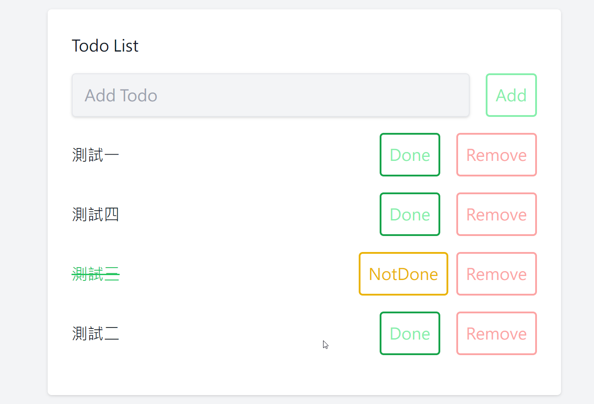

# LAB1- TODOLIST

- [LAB1- TODOLIST](#lab1--todolist)
  - [專案描述](#專案描述)
  - [代辦功能準備](#代辦功能準備)
  - [功能特點](#功能特點)
  - [技術架構](#技術架構)
    - [前端框架](#前端框架)
    - [後端框架](#後端框架)
    - [Devops](#devops)
    - [資料庫](#資料庫)
  - [專案功能](#專案功能)
    - [待辦事項管理](#待辦事項管理)

---

## 專案描述

TODOLIST 是一個前後端分離的應用程式，使用 Next.js 作為前端框架，Spring Boot 作為後端框架。該應用程式允許使用者創建、編輯和管理待辦事項清單。

---

## 代辦功能準備

- [x] RESTFul API
- [x] Nextjs 前端專案 TODOLIST 頁面
  - [x] Tailwind CSS
  - [x] 共用元件處理
  - [x] API 公用介面
- [x] Spring boot 專案建置
  - [x] JPA
  - [x] DB - postgres
- [ ] Devops
  - [ ] 前端-dockerfile 撰寫
  - [ ] 後端-dockerfile 撰寫
  - [ ] 本機 docker run 起來測試
  - [ ] azure devops 串接

---

## 功能特點

- 顯示所有待辦事項：使用者可以查看所有已存在的待辦事項列表。
- 新增待辦事項：使用者可以輸入待辦事項的標題並新增到清單中。
- 完成待辦事項：使用者可以標記已完成的待辦事項，以便進行進度追蹤。
- 標記為未完成：使用者可以將已完成的待辦事項標記為未完成，以便重新處理。
- 移除待辦事項：使用者可以從清單中刪除不需要的待辦事項。

---

## 技術架構

### 前端框架

- 前端框架：專案使用 **React(Nextjs)** 作為前端框架，具有組件化和狀態管理的優勢，提供了良好的用戶界面開發體驗。
- 樣式化：使用 **Tailwind CSS** 作為 CSS 框架，提供了一組預定義的樣式類和實用工具，以加速界面開發和美化。

### 後端框架

- 後端 API：專案與後端的**RESTful API** 進行數據交互，使用 HTTP 請求進行資料的新增、更新和刪除操作。
- 框架 Spring Boot
  - 使用 Spring Boot 提供的 MVC 架構來處理請求和響應
  - 使用 RESTful API 設計風格來定義後端 API

### Devops

使用 Azure DevOps 作為 DevOps 平台，用於協調和管理軟體開發流程。Azure DevOps 提供了版本控制、持續整合/持續部署、工作項追蹤和協作等功能，協助團隊進行協作開發和自動化部署。

### 資料庫

專案使用 PostgreSQL 作為後端資料庫，作為儲存和管理待辦事項的資料庫系統。PostgreSQL 是一個強大且可擴展的關聯式資料庫，具有高度的可靠性、彈性和安全性。

---

## 專案功能

### 待辦事項管理

- 用戶可以創建新的待辦事項
- 用戶可以編輯現有的待辦事項
- 用戶可以標記待辦事項為已完成或未完成
- 用戶可以刪除待辦事項
- 用戶可以查看所有待辦事項或僅查看已完成或未完成的待辦事項

<!-- ### 用戶註冊和登入

- 用戶可以註冊新帳號並進行身份驗證
- 用戶可以使用註冊的帳號進行登入 -->

<!-- ## 用戶身份驗證和授權

- 只有登入的用戶才能創建、編輯和刪除待辦事項
- 只能編輯和刪除自己創建的待辦事項

### 前端路由

- 使用 React Router 來實現前端路由，實現多頁面應用程式
- 使用 Protected Routes 來保護需要登入的頁面
- 以上是一個基本的 TODOLIST 專案的架構和功能描述，你可以根據這個架構進一步開發和擴展你的專案。 -->
